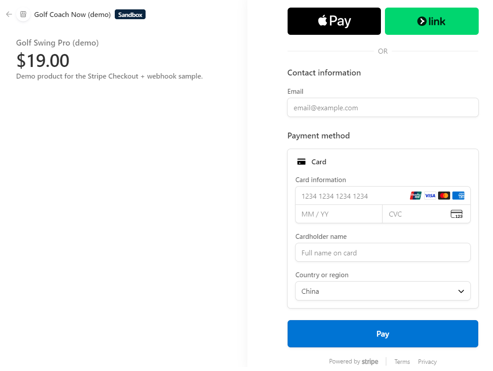
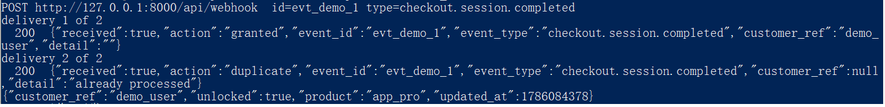
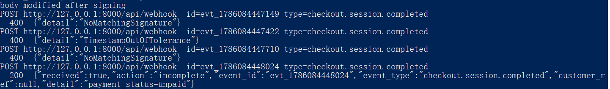
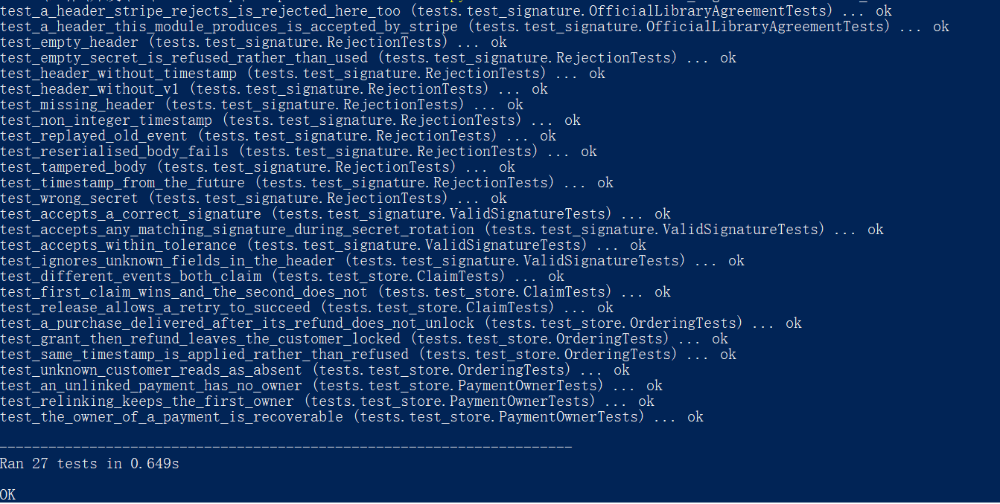

# Stripe Checkout + Webhook — Unlock Once, No Matter What Arrives

A payment integration that unlocks a product after Checkout, built around the
deliveries that are *not* the happy path: the same event arriving twice, an
event replayed off the wire an hour later, a body modified in transit, a
refund landing before the purchase it refunds.

Runs as a service with four endpoints. The whole test suite runs offline —
**no Stripe account, no API key, no network** — because a webhook signature is
an HMAC, not a service call.



---

## The problem this is built around

Getting a payment to succeed is the easy half. Stripe's own tutorial covers
it. The half that decides whether an integration can be left running
unattended is what happens when a delivery is *not* a clean first attempt:

| What arrives | What a naive handler does | What this does |
| --- | --- | --- |
| The same event twice | Unlocks twice, or grants two licences | Claims the event id, second delivery is a no-op |
| A valid event, replayed an hour later | Accepts it — the signature is still genuine | Rejects on the timestamp |
| A body modified after signing | Depends entirely on where you verify | Rejects, and says which of the two causes |
| A refund, which arrives as a Charge with no `client_reference_id` | Logs "no customer reference" and leaves them unlocked | Looks the owner up by `payment_intent` |
| A refund delivered before the purchase | Re-unlocks the customer, silently | Refuses the stale write, or asks for a retry |
| A session completed but not yet paid | Unlocks for free until the debit clears | Records `incomplete`, does not unlock |
| An event type nobody handles | 500s, so Stripe retries it forever | 200, acknowledged and ignored |

Stripe delivers **at least once** and **in no particular order**. Both of
those are documented behaviour, not edge cases — so the interesting question
is never "does the payment work", it is "what does the second delivery do".

---

## Quick start

```bash
pip install -r requirements.txt
python -m unittest discover -s tests -t . -v
```

43 tests, no configuration required.

### Seeing the failure paths without a Stripe account

`tools/send_event.py` signs requests exactly the way Stripe does, so the
server cannot tell the difference. Any string works as the signing secret as
long as **both sides use the same one** — that is all a signature is.

Terminal 1, the service:

```bash
STRIPE_SECRET_KEY=sk_test_demo STRIPE_WEBHOOK_SECRET=whsec_demo_secret \
STRIPE_PRICE_ID=price_demo DATABASE_PATH=demo.db \
uvicorn app:app --port 8000
```

<details>
<summary>PowerShell</summary>

```powershell
$env:STRIPE_SECRET_KEY="sk_test_demo"; $env:STRIPE_WEBHOOK_SECRET="whsec_demo_secret"; $env:STRIPE_PRICE_ID="price_demo"; $env:DATABASE_PATH="demo.db"; python -m uvicorn app:app --port 8000
```

PowerShell has no `VAR=x cmd` prefix and no `&&`, and `curl` is an alias for
`Invoke-WebRequest` — use `curl.exe` below.
</details>

Terminal 2, the events:

```bash
export STRIPE_WEBHOOK_SECRET=whsec_demo_secret
python tools/send_event.py --ref demo_user --event-id evt_demo_1 --repeat 2
```

```
POST http://127.0.0.1:8000/api/webhook  id=evt_demo_1 type=checkout.session.completed
delivery 1 of 2
  200  {"received":true,"action":"granted","event_id":"evt_demo_1","customer_ref":"demo_user"}
delivery 2 of 2
  200  {"received":true,"action":"duplicate","event_id":"evt_demo_1","detail":"already processed"}
```

The customer is unlocked once:



Note the duplicate returns **200, not an error**. A redelivery is normal
traffic; a non-2xx would tell Stripe to keep retrying it.

The rejections, each naming its own cause:

```bash
python tools/send_event.py --ref demo_user --tamper                       # body changed after signing
python tools/send_event.py --ref demo_user --age 3600                     # replayed an hour later
python tools/send_event.py --ref demo_user --secret whsec_other_endpoint  # wrong endpoint's secret
python tools/send_event.py --ref demo_user --payment-status unpaid        # completed but not paid
```



The two `NoMatchingSignature` results are the modified body and the wrong
secret. They are the same rejection because they are indistinguishable from
outside — but the log line inside says which one it was, and they need
opposite fixes.

### Refunds

A refund arrives as a **Charge**, which carries no `client_reference_id` — so
the customer is found through the `payment_intent` recorded at purchase. The
tool emits the realistic shape, without the field:

```bash
python tools/send_event.py --ref buyer_1 --event-id evt_buy --payment-intent pi_abc
python tools/send_event.py --type charge.refunded --event-id evt_ref --payment-intent pi_abc
```

```
200  {"action":"granted","customer_ref":"buyer_1"}
     {"customer_ref":"buyer_1","unlocked":true}

200  {"action":"revoked","customer_ref":"buyer_1"}
     {"customer_ref":"buyer_1","unlocked":false}
```

If the refund is delivered *before* the purchase, there is no mapping yet and
nothing that can be safely revoked:

```bash
python tools/send_event.py --type charge.refunded --payment-intent pi_unknown
```

```
503  {"detail":"owner unknown, retry later"}
```

503 rather than a guess. Stripe redelivers with backoff for up to three days,
and by then the purchase has been processed. This is the failure nobody
notices in testing, because in testing events arrive in the order you sent
them.

### Against your own Stripe account

```bash
cp .env.example .env      # fill in sk_test_, whsec_ and price_
uvicorn app:app --port 8000
```

See [Testing against real Stripe](#testing-against-real-stripe) for the
`stripe listen` route, which is how the run recorded below was produced.

---

## The three things that make it correct

### 1. Verify against the raw bytes

```python
payload = await request.body()      # before any parsing
signature.verify(payload, request.headers.get("stripe-signature"), secret)
```

`json.dumps(json.loads(body))` does not reproduce the whitespace and key order
Stripe signed, so verifying a re-serialised body fails **every** event. It is
the most common reason a correct-looking integration rejects all its traffic,
and there is a test that pins it:

```python
def test_reserialised_body_fails(self):
    reserialised = json.dumps(json.loads(PAYLOAD)).encode()
    with self.assertRaises(signature.NoMatchingSignature):
        signature.verify(reserialised, header_for(), SECRET, now=NOW)
```

### 2. Idempotency is a constraint, not an `if`

```sql
CREATE TABLE processed_events (event_id TEXT PRIMARY KEY, ...)
```

```python
cursor = connection.execute("INSERT OR IGNORE INTO processed_events ...")
return cursor.rowcount == 1        # True exactly once, ever
```

`if not already_processed(id): process(id)` has a race between the check and
the write — two concurrent deliveries can both pass the check. A primary key
cannot. Whichever transaction commits second gets nothing.

When processing fails *after* the claim, the claim is released so Stripe's
retry is actually processed rather than dismissed as a duplicate. An event
marked done with nothing applied is the worst failure mode available, because
nothing looks wrong afterwards.

### 3. A signature that verifies is not a signature that is fresh

A captured request stays valid forever — the HMAC does not expire. The
timestamp in the header is the only thing that catches a replay, so it is
checked against a tolerance (300s, matching Stripe's own libraries) before the
digest is compared.

Comparison is `hmac.compare_digest`, not `==`. String equality returns early
at the first differing byte, which leaks the correct prefix through timing.

---

## Signature verification: implemented, and cross-checked

`stripe.Webhook.construct_event` does this in one line and `requirements.txt`
includes the library. `src/signature.py` exists anyway, for one reason:

**every failure gets its own exception.** `MissingSignature`,
`MalformedSignature`, `TimestampOutOfTolerance`, `NoMatchingSignature`. A
rejected webhook then produces a log line that says what to fix. "400 Bad
Request" does not distinguish *the signing secret belongs to a different
endpoint* from *a proxy rewrote the body*, and those need opposite fixes.

To make sure the two implementations cannot drift apart, the suite runs both
against the same inputs:

```python
def test_a_header_this_module_produces_is_accepted_by_stripe(self):
    event = stripe.Webhook.construct_event(PAYLOAD.decode(), header_for(now), SECRET)
    self.assertEqual(event["id"], "evt_1")

def test_a_header_stripe_rejects_is_rejected_here_too(self):
    with self.assertRaises(stripe.SignatureVerificationError): ...
    with self.assertRaises(signature.SignatureError): ...
```

These skip when the package is absent, so the rest of the suite stays
dependency-free.

---

## Which events unlock, and why those

```python
UNLOCK_EVENTS = {"checkout.session.completed", "checkout.session.async_payment_succeeded"}
REVOKE_EVENTS = {"charge.refunded", "charge.dispute.created"}
```

`async_payment_succeeded` is the one that gets missed. Card payments complete
during Checkout, so `completed` covers them — but bank debits and some wallets
settle minutes to days later and arrive under the async event. An integration
listening only for `completed` silently fails to unlock every customer who did
not pay by card, and it passes every test written with a test card.

Refunds and disputes revoke. Leaving a refunded customer unlocked is the
mirror image of double-unlocking; it is just noticed later and costs more.

---

## Payment is never confirmed by the browser

`/api/checkout/success` deliberately returns nothing about entitlement:

```json
{"status": "payment submitted", "note": "unlock is confirmed by webhook"}
```

A success redirect proves a browser reached a URL. It can be typed by hand, so
anything unlocked on it is unlocked for free. The client app reads
`/api/unlock/{ref}`, and the only thing that can change that answer is a
signed webhook.

---

## Layout

```
app.py                 FastAPI: checkout, webhook, unlock signal, health
src/
  config.py            environment only - secrets never touch disk or logs
  signature.py         Stripe-Signature parsing, HMAC, tolerance, timing-safe compare
  store.py             SQLite: idempotency by primary key, ordering by event.created,
                       payment_intent -> customer mapping
  events.py            which events unlock, which revoke, which are ignored
tools/
  send_event.py        sign and deliver events locally, including bad ones
tests/
  test_signature.py    17 tests: valid, malformed, wrong secret, tampered, replayed
  test_store.py        claim/release, payment ownership, out-of-order writes
  test_webhook.py      end to end over HTTP, every path above
```

The signature and store modules on their own — 27 of the 43, named so the
list reads as what it is, an inventory of ways the integration can be wrong:

```bash
python -m unittest tests.test_signature tests.test_store -v
```



The two `OfficialLibraryAgreementTests` run this module and `stripe-python`
against the same inputs, so an accepted header here is an accepted header
there. The remaining 16 are `test_webhook.py`, which drives the same paths end
to end over HTTP.

```
Ran 43 tests in 0.546s

OK
```

---

## Configuration

| Variable | Notes |
| --- | --- |
| `STRIPE_SECRET_KEY` | `sk_test_…` in test mode. Server side only. |
| `STRIPE_WEBHOOK_SECRET` | `whsec_…`. **One per endpoint** — the secret from a different endpoint verifies nothing and produces the same 400 as an attack. Check this first when every event is rejected. |
| `STRIPE_PRICE_ID` | The price to sell. |
| `WEBHOOK_TOLERANCE_SECONDS` | Replay window. 300 matches Stripe's libraries. |
| `DATABASE_PATH` | SQLite file. `:memory:` in tests. |

`/api/health` reports which variables are unset — **names only, never
values**. A health endpoint is usually the least protected route on a service.

Missing configuration is a warning at startup, not a crash. The service still
answers `/api/health`, which is how you find out what is wrong; a container
that crash-loops on boot tells you far less.

---

## Testing against real Stripe

```bash
stripe listen --forward-to localhost:8000/api/webhook
stripe trigger checkout.session.completed
```

`stripe listen` prints a signing secret for the CLI session — it is not the
one from the dashboard, and using the wrong one of the two is the most common
first-run failure.

To exercise idempotency against the real thing, resend a delivered event:

```bash
stripe events resend evt_1U1h1zRzXbWANeQ8qZz5DxQY
```

### A real run

Not a fixture — a Checkout paid with `4242 4242 4242 4242` in a Stripe
sandbox, forwarded by `stripe listen`. Five events arrived for one payment:

```
INFO  events  no handler for type=payment_intent.succeeded id=evt_3U1i2aRtxNhEwY2T1UqmtJpL, acknowledging
INFO  events  no handler for type=charge.succeeded         id=evt_3U1i2aRtxNhEwY2T1ko5tRQT, acknowledging
INFO  store   claimed event id=evt_1U1i2cRtxNhEwY2TbU9accgm type=checkout.session.completed
INFO  store   payment linked pi_3U1i2aRtxNhEwY2T1R0uGa6A -> golfer_77
INFO  store   entitlement written ref=golfer_77 product=app_pro unlocked=True
INFO  events  granted ref=golfer_77 id=evt_1U1i2cRtxNhEwY2TbU9accgm
INFO  events  no handler for type=payment_intent.created   id=evt_3U1i2aRtxNhEwY2T1KuwUHpX, acknowledging
INFO  events  no handler for type=charge.updated           id=evt_3U1i2aRtxNhEwY2T18tQeVYA, acknowledging
```

One payment, five events, four of them irrelevant. This is why unhandled types
return 200: a handler that 500s on the four it does not care about would leave
Stripe retrying them for three days and mark the endpoint as failing.

They also arrive **out of order** — `payment_intent.succeeded` before
`payment_intent.created` above. Nothing here depends on ordering.

Resending the completed event afterwards returns `duplicate`, and the
entitlement's `updated_at` does not move.

Then refunding the charge for real:

```
INFO  store   entitlement written ref=golfer_77 product=app_pro unlocked=False
INFO  events  revoked ref=golfer_77 id=evt_3U1i2aRtxNhEwY2T14iDUNqf type=charge.refunded
```

```
GET /api/unlock/golfer_77
{"customer_ref":"golfer_77","unlocked":false,"product":"app_pro","updated_at":1786087129}
```

### The bug this run found

The first version of this handler did not revoke on that refund. It logged
*no customer reference* and left the customer unlocked.

The reason is worth stating plainly, because the unit tests all passed:
**`checkout.session.completed` delivers a Session, but `charge.refunded`
delivers a Charge — a different object, with no `client_reference_id`.** The
field the unlock path relies on does not exist on the revoke path. The test
fixture had it, because a fixture written by hand tends to contain the fields
the code already reads.

The fix is the `payment_owners` table: the purchase records
`payment_intent -> customer_ref`, and the refund looks it up. `payment_intent`
is the one id both objects carry.

That leaves one more ordering case. If the refund is delivered *before* the
purchase, the mapping does not exist yet — so instead of guessing, the handler
releases its claim and returns **503**. Stripe redelivers with backoff for up
to three days, by which time the purchase has landed:

```python
if event_type in REVOKE_EVENTS:
    store.release_event(event_id)
    return Outcome("retry", event_id, event_type, detail="owner unknown, retry later")
```

Three tests now cover it, including the redelivery — which only passes because
the claim was released rather than left in place.

---

## Going live

Test and live mode are two separate universes inside one Stripe account. No
object crosses between them — a price id from test mode does not exist in live
mode, and neither does a customer, a session, or an event id. Switching is
therefore four values, not a flag in the code:

| | Test | Live |
| --- | --- | --- |
| `STRIPE_SECRET_KEY` | `sk_test_…` | `sk_live_…` |
| `STRIPE_PRICE_ID` | created in test mode | **recreate the product and price in live mode** |
| `STRIPE_WEBHOOK_SECRET` | from `stripe listen`, or a test-mode endpoint | from the **live-mode** endpoint, registered separately |
| `SUCCESS_URL` / `CANCEL_URL` | localhost | your real domain, HTTPS |

Nothing in `src/` changes. Every mode-specific value is an environment
variable, so the same artefact is deployed to both.

Before taking real money:

- **Register the live webhook endpoint separately.** Test-mode endpoints do
  not receive live events. A deployment that works in test and unlocks nobody
  in production is almost always this.
- **Terminate TLS in front of the service.** The signature protects against a
  modified body; it does not hide the body.
- **Keep the database.** `unlocks.db` *is* the record of who paid. On a
  container with no volume it is deleted on the next deploy, and there is no
  way to reconstruct it from Stripe without replaying every historical event.
  Point `DATABASE_PATH` at a mounted volume, or move the two tables in
  `store.py` to Postgres — the schema is fifteen lines and the guarantees it
  relies on (primary key, `ON CONFLICT`) are the same there.
- **Watch the delivery-failure rate** in Dashboard → Webhooks. Stripe retries
  a failing endpoint for up to three days, then gives up. That counter going
  non-zero is the earliest signal that something broke.
